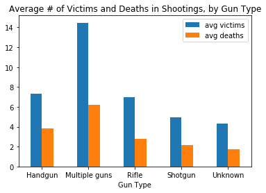

# Mass Shootings in the United States from 1966-2016

### Contributors: Angelica, Mengjia, Eddie

## Goal:

We are analyzing data on mass shootings in the U.S. using Python Pandas, the Matplotlib library, gmaps library, and Google APIs. Our goal is to prove or disprove our hypothesis that the number of mass shooting victims is related to the location of the shooting, as well as the type of gun used. We believe that there are less victims when the shooting occurs in close proximity to the nearest police department. Furthermore, we believe that there are more victims when multiple weapons or more powerful weapons are used than when a handgun is used. Our second hypothesis is that the amount of mass shootings in the U.S. is determined by location type and geographic location. We specifically believe that most mass shootings occur in crowded places, such as schools, as apposed to homes. 

### What Classifies as a "Mass Shooting"?
According to the Stanford MSA Project, a mass shooting is " 3 or more shooting victims (not necessarily fatalities), not including the shooter. The shooting must not be identifiably gang, drug, or organized crime related."*

*[https://library.stanford.edu/projects/mass-shootings-america](https://library.stanford.edu/projects/mass-shootings-america)

### Files:
[Stanford MSA Data](Stanford_MSA_Shooting.csv)

* CSV file downloaded from: [Stanford Geospatial Center](https://github.com/StanfordGeospatialCenter/MSA/tree/master/Data)

### Calculations Added:
* `Death Percent`: Percent of deaths from the number of total victims (including law enforcement)
* `Nearest Police Department`: Utilized the Google nearby search API to find the nearest police department to the shooting site
* `Nearest Police Department Proximity`: Utilized the Google distance matrix API to find the distance from the shooting site to the nearest police department 

### How to Run the Script:
* Sign up for a google API key: [https://developers.google.com/places/web-service/get-api-key](https://developers.google.com/places/web-service/get-api-key)

* Input key in [config.py](config.py)

### Our Conclusions: [conclusions.txt](conclusions.txt)

